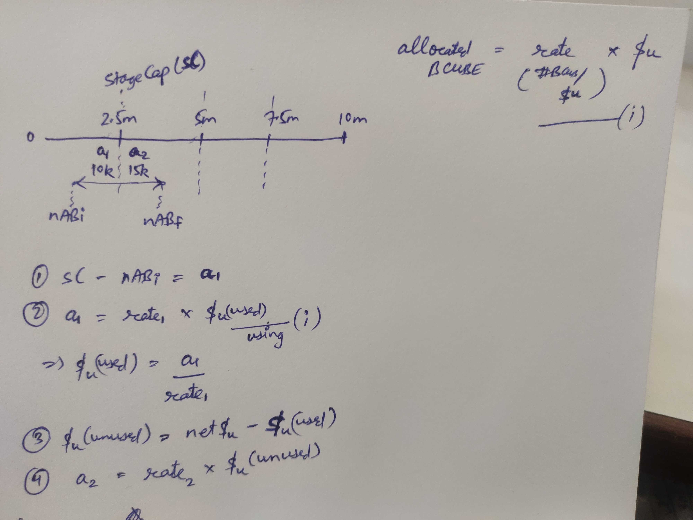

# b-cube-ico

## Smart Contract Summary

1. BCUBEToken: ERC-20 token contract for the $BCUBE token
2. BCUBEPrivateSale: contract that performs the private crowdsale of BCUBE tokens to private investors, accepting payments in $ETH and $USDT, using Chainlink's price feed to offer $BCUBE tokens to investors at different prices in 4 different rounds/stages. These inherit from OpenZeppelin's Crowdsale contracts.
3. Treasury: contract in which the total supply of BCUBE tokens i.e. 50m is supposed to be minted after the private sale. It is responsible for allowing private sale participants to claim their allocated share of tokens, and allowing the team and advisors to claim their share of allocated BCUBE tokens _in a vested manner_.

## Private Sale Details

Following details have been implemented in BCUBEPrivateSale.sol

Total number of BCUBE to be sold = 10.000.000 Tokens => $475.000

1. First 2.500.000 Tokens will be sold at $0.04 (Minimum token purchase worth $1000) i.e. round 1
2. Second 2.500.000 Token will be sold at $0.045 (Minimum token purchase worth $500) i.e. round 2
3. Third 2.500.000 Tokens will be sold at $0.05 (Minimum token purchase worth $250) i.e. round 3
4. Fourth 2.500.000 Tokens will be sold at $0.055 (Minimum token purchase worth $100) i.e. round 4

Only KYC/AML whitelisted folks can participate in the private sale

## Treasury Details

Following details have been implemented in Treasury.sol

- 10m: Private sale - 25% / Month for participants
- 15m + 10m - (#BCUBE allocated in Private Sale): Public Sale
- 5m (10% Team) - 12.5% / 6 Months
- 7.5m (15% dev fund) 25%/ 6 Months
- 2.5m (5% Advisors) - 25% / 6 Months - team adds/removed advisors and decides what % each advisor gets
- 7m (14% Reserves)
- 2.5m (5% Community / Contributors&Supporters )
- 0.5m (1% Bounty)

## General Details

1. Deployer is the address that will deploy the 3 contracts, which is named as WhitelistAdmin in the contract.
2. Team's address is the address that will initially have ownership of all tokens except private sale share. This address is named as \_wallet or wallet() in the contracts.
3. Number of advisors and their % share will be decided by wallet().
4. Public sale share will be distributed to users publically after the private sale.
5. BCUBEPrivateSale and Treasury will live on the same address as Treasury is inheriting BCUBEPrivateSale.

## Timeline for the entire sale (approx.)

1. 1st 80 days: private sale
2. BCUBE tokens minted in the Treasury
3. Next 3 months: public sale
4. Token listing on CEXes/DEXes. Trading for general public starts.
5. Vesting of allocated BCUBE tokens in private sale, starts from listing date. Tokens are locked until this date.
6. First slot of BCUBE tokens of private sale investors are unlocked after 1 month of listing
7. First slot of team, advisors are unlocked after 6 months of listing

## Running the tests

After 'npm install'ing in the project root,

1. `ganache-cli -a 25 -f "https://mainnet.infura.io/v3/your-infura-project-id" --unlock 0xc6cde7c39eb2f0f0095f41570af89efc2c1ea828 --networkId 4447`
2. `truffle --network development test`

In tests of BCUBE Private Sale, approx. 23 tests are seen failing by very narrow margins. Plz consider these as intended behaviour.

Total tests: 186,
Passing: 163,
Failing: 23

## Math

For user buying BCUBE on stage boundaries or when netAllocatedBcube exceeds stageCap

## Audit Comments

### Warnings:

1. Fundamentally onlyWhitelistAdmin and the checks for advisor and private investor are doing the same thing, i.e. checking the root variables (\_whitelistAdmins for onlyWhitelistAdmin) for proof of change of variable on addition of admin/advisor/privateInvestor. It’s just that it looks a bit different for advisor/privateInvestor as their root variables (bcubeAllocationRegistry, advisors) are structured differently. Other solutions on top of this will only add to storage costs.
2. Fixed.
3. On line 112, 118 in BCubePrivateSale.sol, I’ve purposefully excluded accepting output variables other than int256 price, bcoz they’re simply not useful for us. Apart from this, the output format of the price feed matches exactly as recommended by Chainlink in the blog and also in their docs. And fixed the SafeMath.
